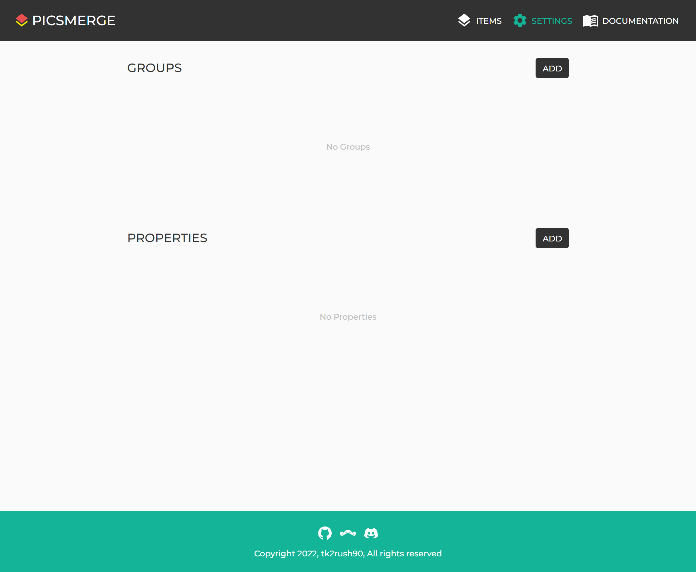

# Create Group

You can create a Group from [Settings page](/app/settings).

Click **ADD** button on top right of Groups section.

You can create a Group by entering the Group name and number of layers.
The number of layers must be between **1** and **10**.

## What is the number of layers?

Items in each group can consist of multiple layers. Let's take an example to make it easier to understand.

This image consists of 4 layers.

- Front hair
- Face
- Back hair
- Background

This image may be divided into **Hair**, **Face** and **Background** Groups,
then the **Hair** Group can have 2 layers: For front hair and back hair.

You can later decide in what order to place the layers in each Group when merging the Items.

To know this, see [How to Order Layers](/app/documentation/merge/order-layers).
