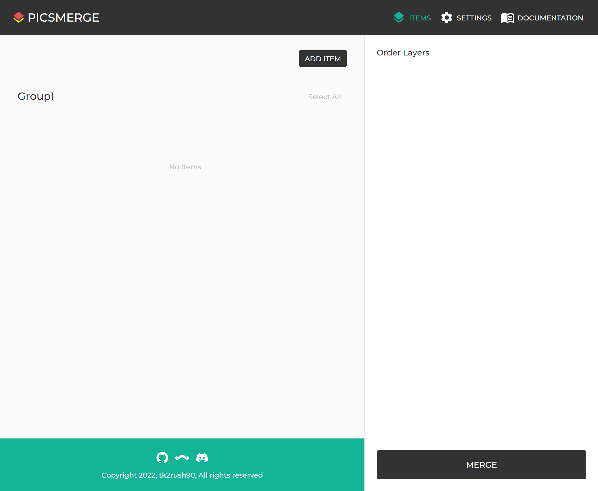

# Create Item

You can create an Item from [Items page](/app/items).

Click **ADD ITEM** button on top right of Items section.

You can create an Item by set the Group and layers and Properties.
Before uploading layers and setting Properties, you need to select a Group for Item.

After selecting the Group, Layers and Properties fields will be visible.
The layers can be uploaded by drag-and-drop or clicking **Click here** button.
You can upload images maximum to the number of layers of Group.

The order of layers for Item is determined by uploaded order.
If you want to change the order, click remove icon and upload again.

You can also set Properties for the Item.

## Are the edges of the image sharp?

Do not worry. This is just a preview.
The original of the image is saved correctly and you can choose whether to smooth the edges when downloading.

## Order of Layers

The lower numbered layers will be drawn first and the higher numbered layers will be drawn later.

## Lack of Layers

You may want to upload images less than configured number of layers. That's okay.
Insufficient layers will be treated as blank images when merged.
However, if you want to make the first layer to empty and second layer to visible,
you need to upload blank image for the first layer.
