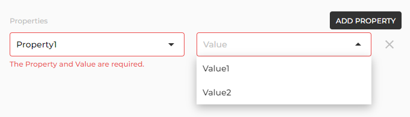

# Create Property

You can create a Property from [Settings page](/app/documentation/settings).

Click **ADD** button on top right of Properties section.

You can create a Property by entering the Property name and its Values.

Click **ADD** button to add some Values for Property. You can't set duplicated Value to Property.

The created Properties and Values can be set when creating an Item.
