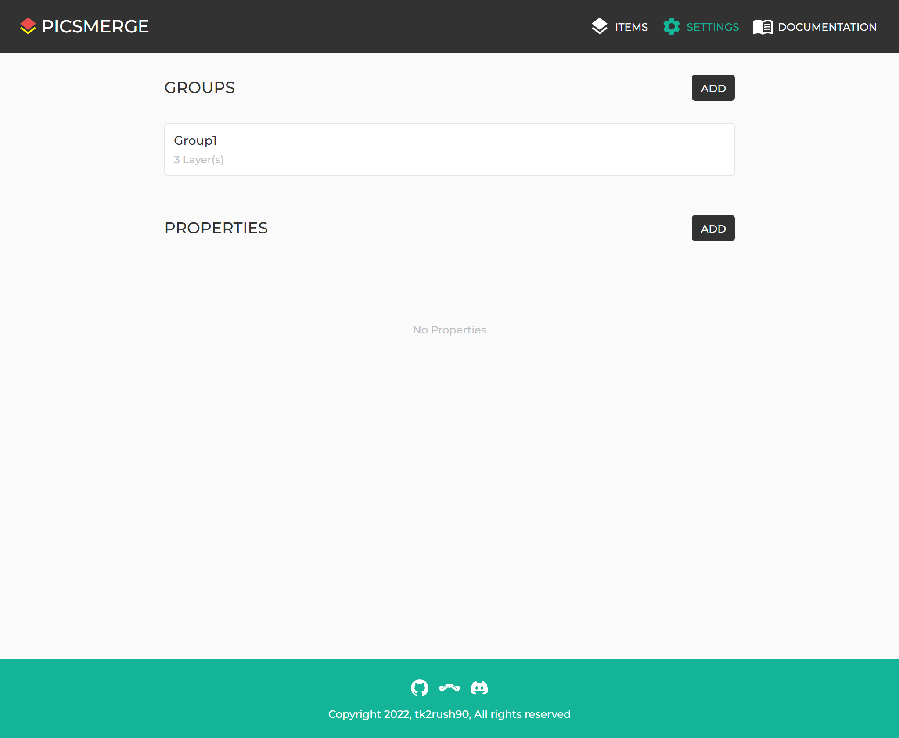
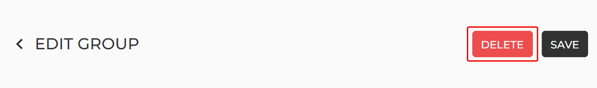
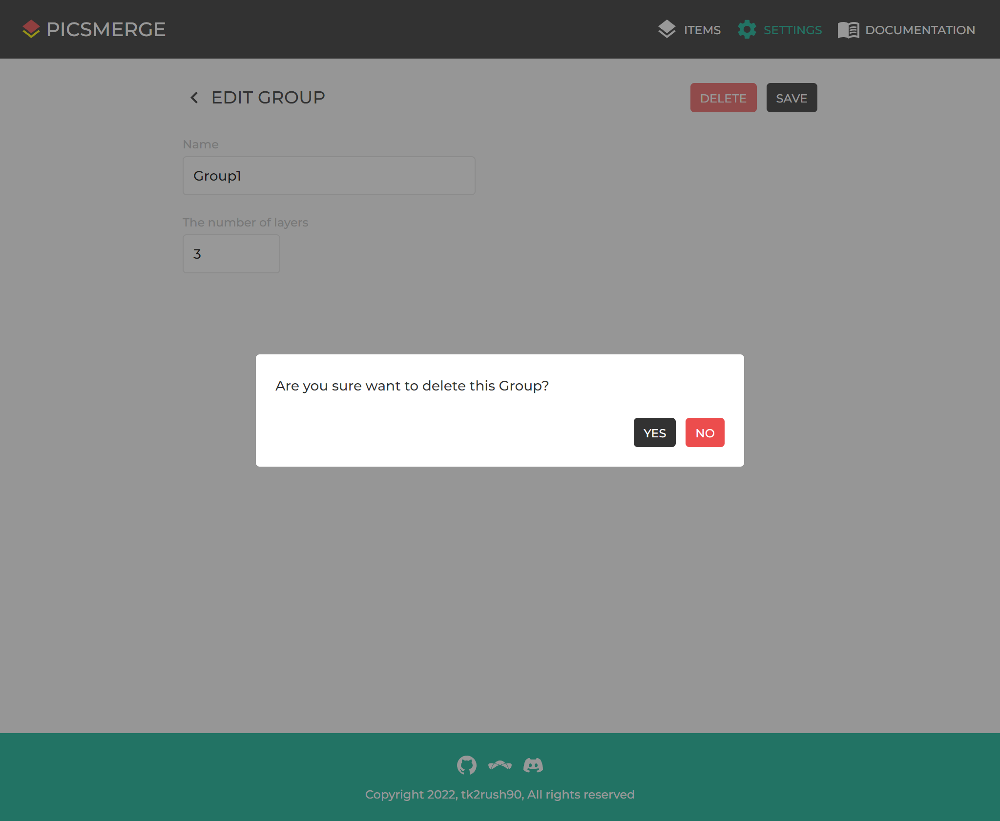

# Delete Group

After creating a Group, you can see it on the [Settings page](/app/settings).

If you want to delete this, click on the Group.

On the Edit Group page, click the **DELETE** button at the top.

Then you can see the confirmation modal,
and you can delete the Group by clicking **YES**.
Note that all Items in the Group are also deleted.
