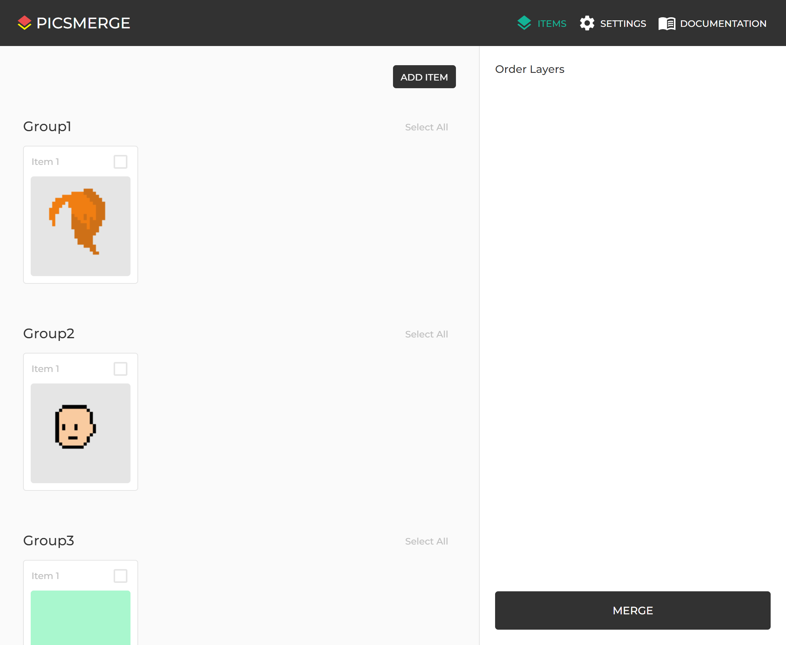
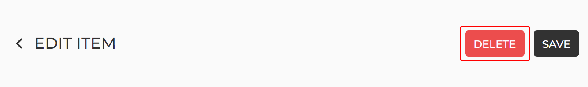
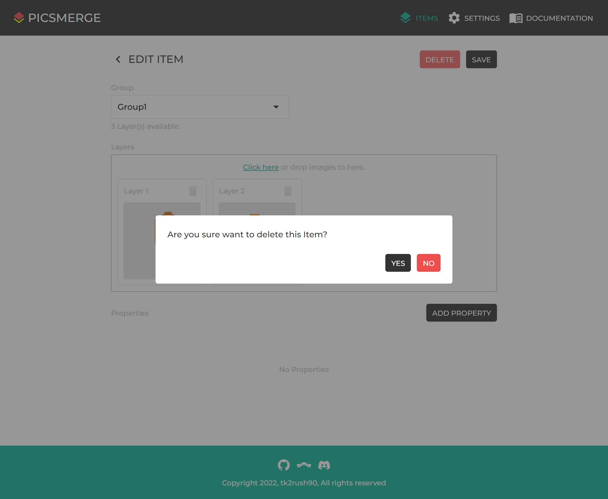

# Delete Item

After creating an Item, you can see it on the [Items page](/app/items).

If you want to delete this, click on the Item.

On the Edit Item page, click the **DELETE** button at the top.

Then you can see the confirmation modal,
and you can delete the Item by clicking **YES**.
