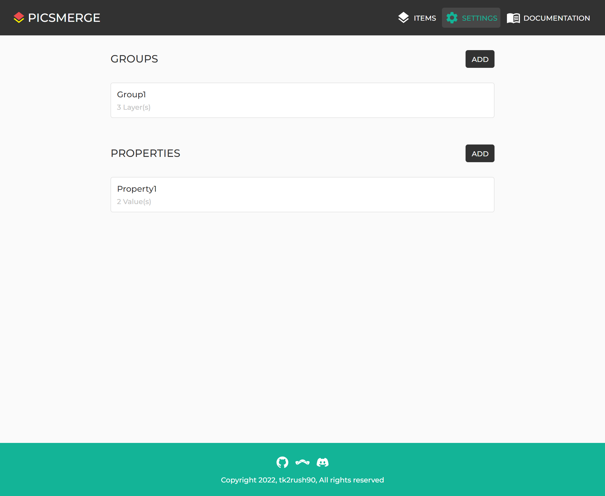

# Delete Property

After creating a Property, you can see it on the [Settings page](/app/settings).

If you want to delete this, click on the Property.

On the Edit Property page, click the **DELETE** button at the top.

Then you can see the confirmation modal,
and you can delete the Property by clicking **YES**.
Note that all Values of this Property in the Items are also deleted.
