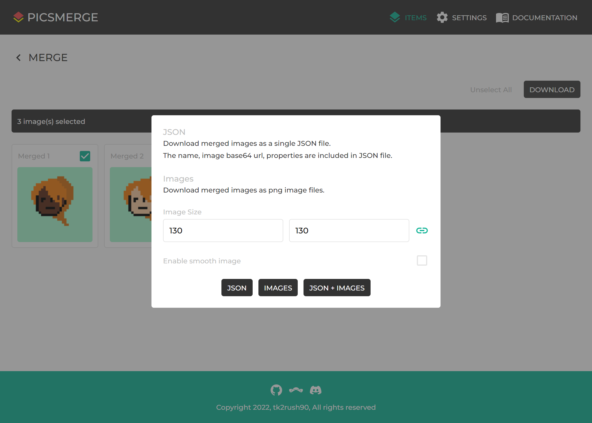
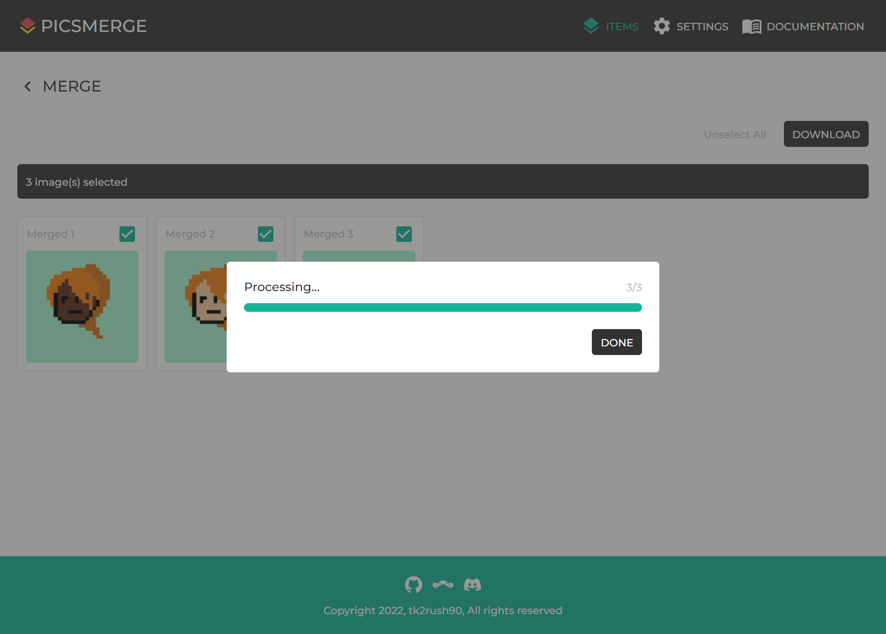

# Download



To download your merged images, select images and click **DOWNLOAD** button.
Then you can set download configuration.

The image size value must be greater than 0 and less than or equal to 2000.

If **Enable smooth image** is checked, the edges of the image to be downloaded are rendered smoothly.
This may differ from what the preview looks like.

Also, you can choose download type between **JSON**, **IMAGES**, and **JSON + IMAGES**.



After clicking download type, the application process the images according to your configuration.
You can download zip file when the processing done.

## JSON

When you download your images with JSON type, you can see following structure of contents from the JSON file.

```json
[
  {
    "name": "Merged 1",
    "image": "data:image/png;base64,iVBORw0KGgoAAAANSUhEUgAAAIIAAACCCAYAAACKAxD9AAAAAXNSR0IArs4c6QAABI5JREFUeF7tnTtuFEEQhscBSGSIBC7gkIQzICGHRCQcgYDUCQGJL8ARSIgIuYUTQkvERAiRIJGANFig7endqn5NVXd/Dt2Prfnr81/VPSv57MPP698LP9MrcAYI0zOwCgAIcAAIMPBfARwBGnAEGMARYCBQgNIAEpQGGKA0wAClAQZiCtAjwAU9AgzQI8AAPQIM0CPAwFEFaBYj0pxfXiQhc3P1KWm+x8mAAAicGo79ZeIIHj3LICZAMBC9xUc+u3patO2XH3eK1vfYMwzZIwBCOseAENEMR0gHyeUKHCE9LV04Qmli02U5XDGDQwCCghJAUIi0xxQcob3KOIJCYxxBIVLpFOu/9pz4RwTD3BEAIQfF+msAIUNTHCFDNGkJjiAptM84jpChM46QIVq4pIYDvPp492Dbd89/VYgsf4sRwNjdEQBhC5yHt5WAkG8E/1biCBki4gg4wqpADghhTxBKad0jhPGkOgSlQekogKAUqmBaFz0CIBRkWLkUEJRCpUyjNETUatETSEmx7hkAARBWBQABEADhmF1TGqRCtixTHB8BARCaXSBJ0tIsSgptx5sfH3EEOSmUhiMaSRdIkrQ4gqSQQ0e4//bbJqqXjx+lP8mJFalglH7fgeNjxvEREDg1rNgAAiAAwq2D0iwqHeH9568newappwjXf3/z4OR+Uo8gjdMjNOoRAKFq7xzdzPweQdMjAAIgrAoAwgAghI8Q3jTmOILUE4SfGYIUri+9Zwj3v3798GTmPDSHYYDNSwMgbJkAhMi3mHGE9rav+QQcYVkWSoPBvwTO6RE0RLecE4IS3iPQI2SoDwg+rpS7bBYzeKu6BEeoKuffzXAEHCGK1Yt7Tza/T70naMDrwZahI4QnnR7vDcxLQxgAILTGWLf/7sdHQNAlZu9ZgKBQnNKgEKl0So3SIL2UkmKUepLUe4Lw8zxeKQ/ZIwCChLo8PkRpAAQ50dIMQFiWhdJg8K6hx1NDao/QQ08wZI8g2V7pOCCUKqhYX+PUoPiYoimAUCSfbjEg6HRqPcu8WYw9YAiH1MzVFmkGB3DXIwBCbYzz9sMRIrrhCHkwVV9FaaguqbihS0fQ3DWIT1YwQfp+QY/vEiQ5ACGiECBI2BiNx46YLUMBhJbqFuwNCAXiKZd2URqUz6Kedn55oZ6rmdjju4Uu7hE04pfMAYStejhCCVG3a3GECiJabIEj4Agq7kpB6dEhpiwNEg2AICk0yTggTJJo6TEBQVKI8VUBCRR6hElAAYRJEi09JiBICk0yDgiTJFp6TECQFJp0fAQwuFCqAC8gVBBxhC0AYYQsVngGQKggIlv4UIAewUcezKMABPMU+AgAEHzkwTwKQDBPgY8AAMFHHsyjAATzFPgIABB85ME8CkAwT4GPAADBRx7MowAE8xT4CAAQfOTBPApAME+BjwAAwUcezKMABPMU+AgAEHzkwTwKQDBPgY8AAMFHHsyjAATzFPgIABB85ME8CkAwT4GPAADBRx7MowAE8xT4CAAQfOTBPApAME+BjwAAwUcezKMABPMU+AgAEHzkwTyKP0GiRhlsPURpAAAAAElFTkSuQmCC",
    "properties": [
      {
        "name": "Property1",
        "value": "Value1"
      },
      {
        "name": "Facial Expression",
        "value": "Bored"
      },
      {
        "name": "Skin",
        "value": "Black"
      }
    ]
  },
  {
    "name": "Merged 2",
    "image": "data:image/png;base64,iVBORw0KGgoAAAANSUhEUgAAAIIAAACCCAYAAACKAxD9AAAAAXNSR0IArs4c6QAABI1JREFUeF7tnTtuFEEQhscBQs4QCSfwBZC4ARJyQEzKERCZEwISZ5yBlJiAQyD5Akg+AkIkFhFIgwXant6t6tdUdffn0P3Ymr8+/1Xds5LPPt3d/F74mV6BM0CYnoFVAECAA0CAgf8K4AjQgCPAAI4AA4EClAaQoDTAAKUBBigNMBBTgB4BLugRYIAeAQboEWCAHgEGjipAsxiR5uLqMgmZb9dfkuZ7nAwIgMCp4dhfJo7g0bMMYgIEA9FbfOSL6+dF297+fFC0vseeYcgeARDSOQaEiGY4QjpILlfgCOlp6cIRShObLsvhihkcAhAUlACCQqQ9puAI7VXGERQa4wgKkUqnWP+158Q/IhjmjgAIOSjWXwMIGZriCBmiSUtwBEmhfcZxhAydcYQM0cIlNRzg/OWHg23vPr+tEFn+FiOAsbsjAMIWOA9vKwEh3wj+rcQRMkTEEXCEVYEcEMKeIJTSukcI40l1CEqD0lEAQSlUwbQuegRAKMiwcikgKIVKmUZpiKjVoieQkmLdMwACIKwKAAIgAMIxu6Y0SIVsWaY4PgICIDS7QJKkpVmUFNqONz8+4ghyUigNRzSSLpAkaXEESSGHjvDo/fdNVL++fkx/khMrUsEo/b4Dx8eM4yMgcGpYsQEEQACEewelWVQ6wsNnr0/2DFJPEa7/8e7xyf2kHkEap0do1CMAQtXeObqZ+T2CpkcABEBYFQCEAUAIHyG8acxxBKknCD8zBClcX3rPEO5/8+bJycx5aA7DAJuXBkDYMgEIkW8x4wjtbV/zCTjCsiyUBoN/CZzTI2iIbjknBCW8R6BHyFAfEHxcKXfZLGbwVnUJjlBVzr+b4Qg4QhSrV+dPN79PvSdowOvBlqEjhCedHu8NzEtDGAAgtMZYt//ux0dA0CVm71mAoFCc0qAQqXRKjdIgvZSSYpR6ktR7gvDzPF4pD9kjAIKEujw+RGkABDnR0gxAWJaF0mDwrqHHU0Nqj9BDTzBkjyDZXuk4IJQqqFhf49Sg+JiiKYBQJJ9uMSDodGo9y7xZjD1gCIfUzNUWaQYHcNcjAEJtjPP2wxEiuuEIeTBVX0VpqC6puKFLR9DcNYhPVjBB+n5Bj+8SJDkAIaIQIEjYGI3HjpgtQwGEluoW7A0IBeIpl3ZRGpTPop52cXWpnquZ2OO7hS7uETTil8wBhK16OEIJUfdrcYQKIlpsgSPgCCruSkHp0SGmLA0SDYAgKTTJOCBMkmjpMQFBUojxVQEJFHqESUABhEkSLT0mIEgKTTIOCJMkWnpMQJAUmnR8BDC4UKoALyBUEHGELQBhhCxWeAZAqCAiW/hQgB7BRx7MowAE8xT4CAAQfOTBPApAME+BjwAAwUcezKMABPMU+AgAEHzkwTwKQDBPgY8AAMFHHsyjAATzFPgIABB85ME8CkAwT4GPAADBRx7MowAE8xT4CAAQfOTBPApAME+BjwAAwUcezKMABPMU+AgAEHzkwTwKQDBPgY8AAMFHHsyjAATzFPgIABB85ME8CkAwT4GPAADBRx7MowAE8xT4CAAQfOTBPIo/nZFWGcMNkbMAAAAASUVORK5CYII=",
    "properties": [
      {
        "name": "Property1",
        "value": "Value1"
      },
      {
        "name": "Facial Expression",
        "value": "Bored"
      },
      {
        "name": "Skin",
        "value": "White"
      }
    ]
  },
  {
    "name": "Merged 3",
    "image": "data:image/png;base64,iVBORw0KGgoAAAANSUhEUgAAAIIAAACCCAYAAACKAxD9AAAAAXNSR0IArs4c6QAABItJREFUeF7tnT9uFTEQhzcFQukQDSfIBZC4ARJKQU3LERBdGgqadJyBlpqCQyDlAkg5AkI0ERVISwR6Xr834387Y/tLmbW94998+c3Y70k5+3R383vhZ3oFzgBhegZWAQABDgABBv4rgCNAA44AAzgCDAQKUBpAgtIAA5QGGKA0wEBMAXoEuKBHgAF6BBigR4ABegQYOKoAzWJEmouryyRkvl1/SRrvcTAgAAKnhmN/mTiCR88yiAkQDERv8coX18+Llr39+aBofo89w5A9AiCkcwwIEc1whHSQXM7AEdLT0oUjlCY2XZbDGTM4BCAoKAEEhUh7DMER2quMIyg0xhEUIpUOsf5rz4l/RDDMHQEQclCsPwcQMjTFETJEk6bgCJJC+zzHETJ0xhEyRAun1HCA85cfDpa9+/y2QmT5S4wAxu6OAAhb4Dx8WgkI+UbwbyaOkCEijoAjrArkgBD2BKGU1j1CGE+qQ1AalI4CCEqhCoZ10SMAQkGGlVMBQSlUyjBKQ0StFj2BlBTrngEQAGFVABAAARCO2TWlQSpkyzLF8REQAKHZBZIkLc2ipND2efPjI44gJ4XScEQj6QJJkhZHkBRy6AiP3n/fRPXr68f0nZyYkQpG6fcdOD5mHB8BgVPDig0gAAIg3DsozaLSER4+e31QdFJ7iHD+j3ePT/YgUo8gPadHaNQjAELV3jm6mPk9gqZHAARAWBUAhAFACLcQ3jRaOELYY5TeM4Sg3rx5cjJzHprDMMDmpQEQtkwAQuRbzDhCe9vXvAFHWJaF0mDwL4FzegQN0S3HhKCE9wj0CBnqA4KPK+Uum8UM3qpOwRGqyvl3MRwBR4hi9er86eb3qZ8lNOD1YMnQEcKTTo/3BualIQwAEFpjrFt/9+MjIOgSs/coQFAoTmlQiFQ6pEZpCM/xUkypPUjqPUH4fo9XykP2CIAgoS8/H6I0AIKcaGkEIEgKRb4PIR0XKQ0KUXs8NaT2CD30BEP2CBn8JU0BhCS58gbXODXkvVk/CxD0WmWPBIRs6apONG8WY7sJ4Ug995cqNIMDuOsRAKEU2zrzcYSIjjhCHbiKV6E0FEuYvIBLR9DcNSTvNGHCiBdG0vYBIaIQIEjYGD2PHTFbhgIILdUtWBsQCsRTTu2iNCj3oh52cXWpHqsZ2ONnC13cI2jELxkDCFv1cIQSou7n4ggVRLRYAkfAEVTclYLSo0NMWRokGgBBUmiS54AwSaKlbQKCpBDPVwUkUOgRJgEFECZJtLRNQJAUmuQ5IEySaGmbgCApNOnzEcDgQqkCvIBQQcQRlgCEEbJYYQ+AUEFElvChAD2CjzyYRwEI5inwEQAg+MiDeRSAYJ4CHwEAgo88mEcBCOYp8BEAIPjIg3kUgGCeAh8BAIKPPJhHAQjmKfARACD4yIN5FIBgngIfAQCCjzyYRwEI5inwEQAg+MiDeRSAYJ4CHwEAgo88mEcBCOYp8BEAIPjIg3kUgGCeAh8BAIKPPJhHAQjmKfARACD4yIN5FIBgngIfAQCCjzyYRwEI5inwEQAg+MiDeRR/AM+gVhnyBK/TAAAAAElFTkSuQmCC",
    "properties": [
      {
        "name": "Property1",
        "value": "Value1"
      },
      {
        "name": "Skin",
        "value": "White"
      },
      {
        "name": "Facial Expression",
        "value": "Default"
      }
    ]
  }
]
```

The `image` is base64 url for each merged image.

The Properties in each Item are set in the `properties` field after duplications are removed.
