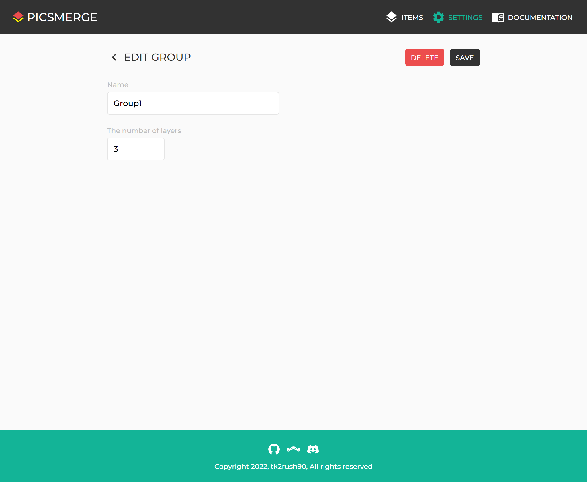
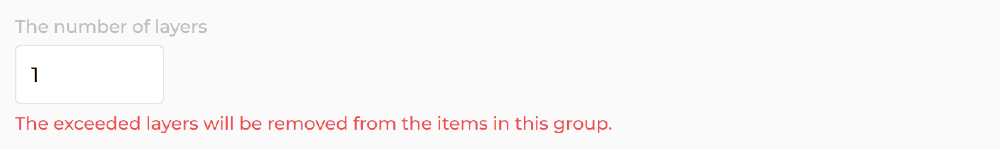

# Edit Group

After creating a Group, you can see it on the [Settings page](/app/settings).

If you want to edit this, click on the Group.

You can change its name and number of layers.

If you want to reduce the number of layers,
you will see the message: **The exceeded layers will be removed from the items in this group**.

You may be seeing this image for the second time.

This image can consist of **Hair**, **Face**, and **Background** Groups,
and the **Hair** Group can be divided into front hair and back hair layers.

Suppose you have uploaded front hair to the first layer of the **Hair** Group and back hair to the second layer.
And you want to reduce the number of layers of **Hair** Group to **1** on the Edit Group page.

In that case, the back hair of all Items in the Hair Group will be removed once you save your changes.
