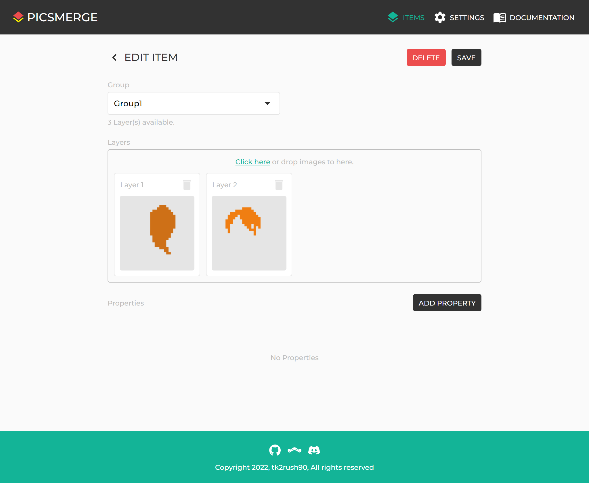
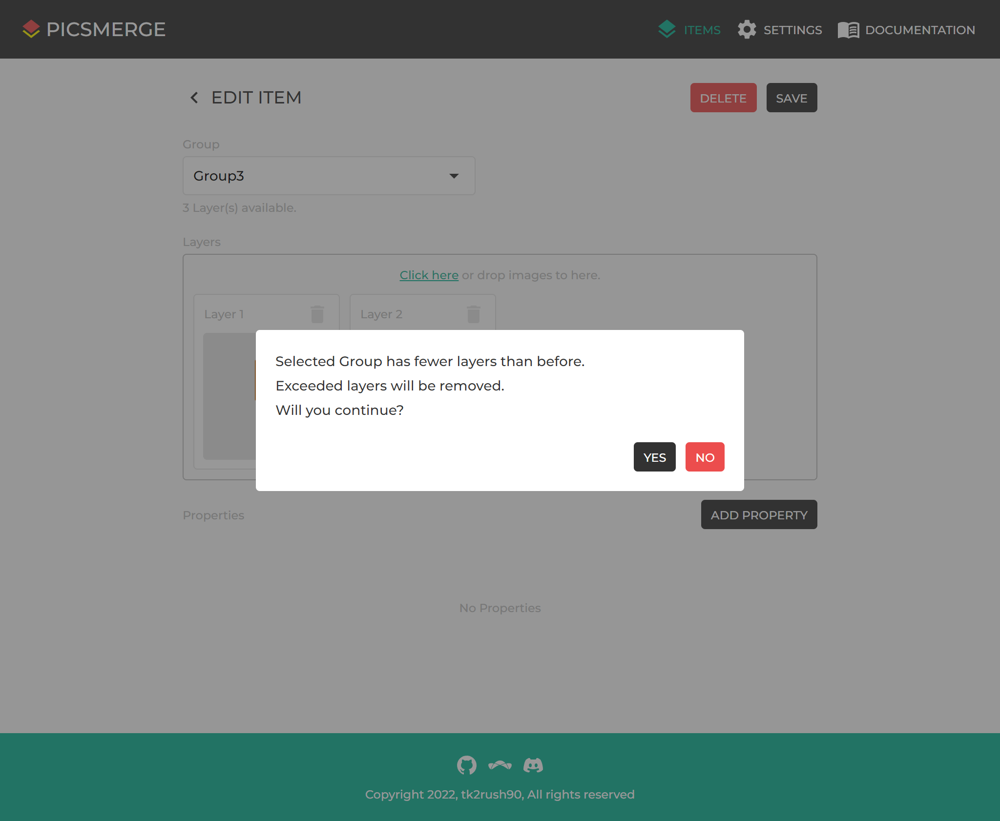
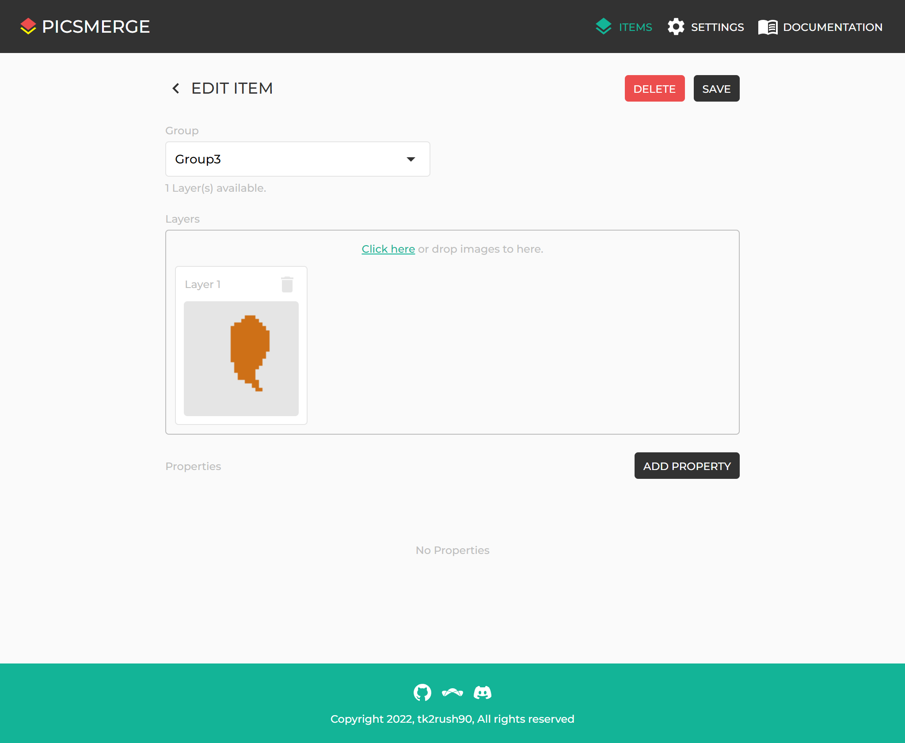

# Edit Item

After creating an Item, you can see it on the [Items page](/app/items).

If you want to edit this, click on the Item.

You can change the Group, image for layers, and Properties.

If you try to change to a Group with fewer layers, you will see a warning like the one above.

And if you click **YES**, the last layer is removed in order.
