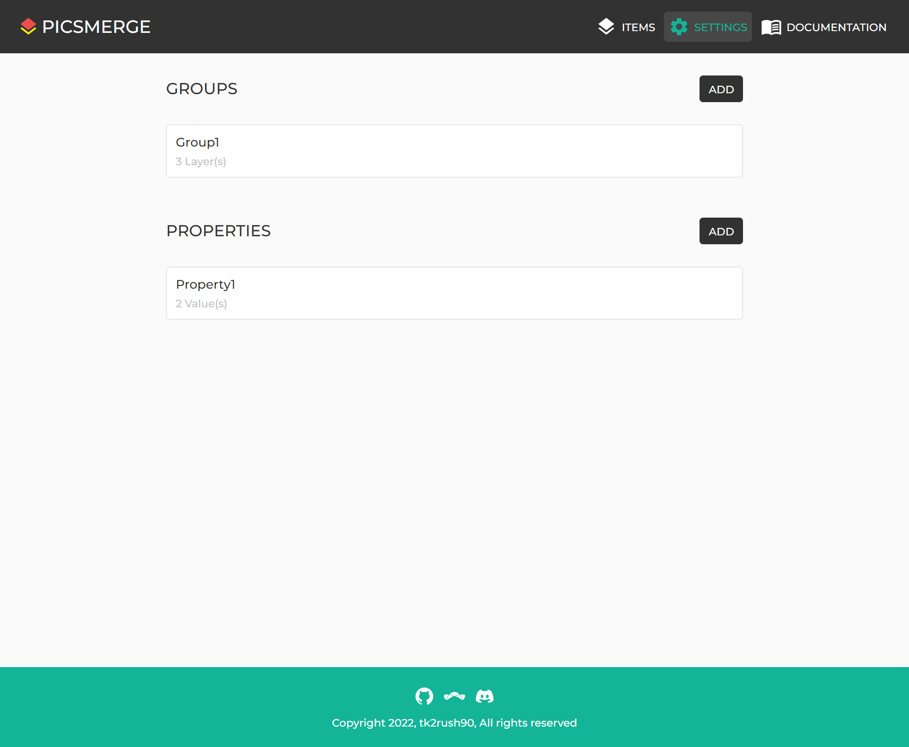
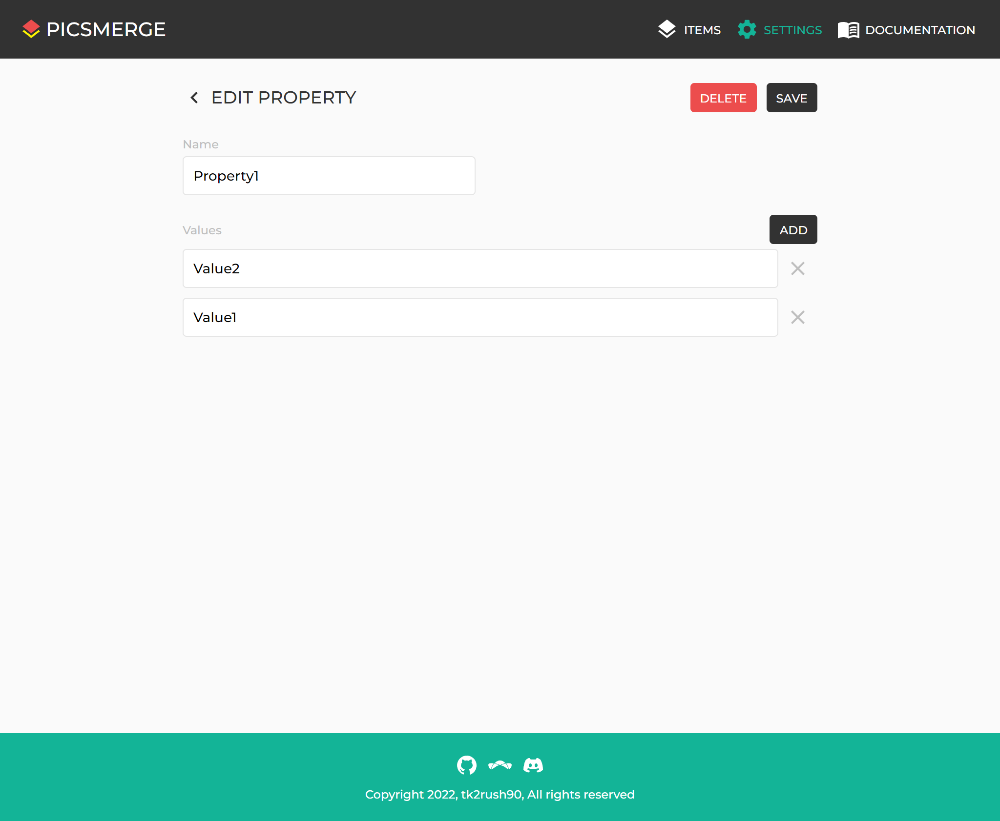
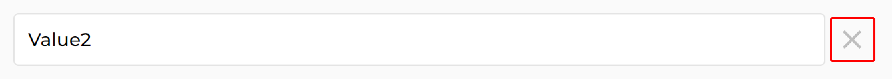

# Edit Property

After creating a Property, you can see it on the [Settings page](/app/settings).

If you want to edit this, click on the Property.

You can change its name and Values.

If you click the **x** button to remove the existing Value and then save the changes,
the Value of that Property will be removed from all Items.
