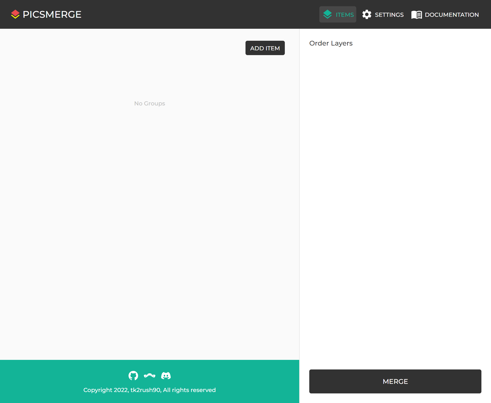

# Group

A Group is a collection of images that you want to merge.

You can see the Groups you created on the [Items page](/app/items).
To add an Item, you must create a Group first.

Now, let's learn [How to Create Group](/app/documentation/group/create).
