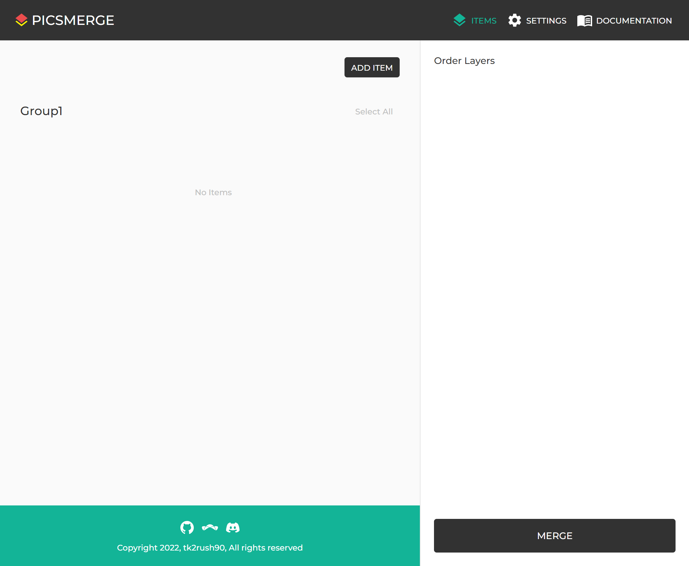

# Item

Item is the smallest unit for merging.

You can see the items created on the [Items page](/app/items). Items will be shown grouped.

To learn to create an Item, see [How to Create Item](/app/documentation/item/create).
