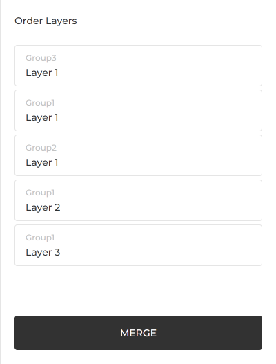

# Merge

To merge your Items, you need to select the Items to merge from [Items page](/app/items).

Then order the layers of each Group by drag-and-drop.
For this example, we need to order layers like below:

1. Group3 - Layer 1
2. Group1 - Layer 1
3. Group2 - Layer 1
4. Group1 - Layer 2
5. Group1 - Layer 3

Note that Layer 3 of Group1 is an empty layer.
So that can be placed to anywhere.

Here is ordered layers.

Then click **MERGE** button to merge images.

Congratulation! Now we got some merged images.
Do you want to download it?
Go to [How to Download](/app/documentation/download).

## Order of Layers

Layers sorted in the Order Layers section are rendered from top to bottom.
So the image layer you want to show in front should be moved to the bottom.
