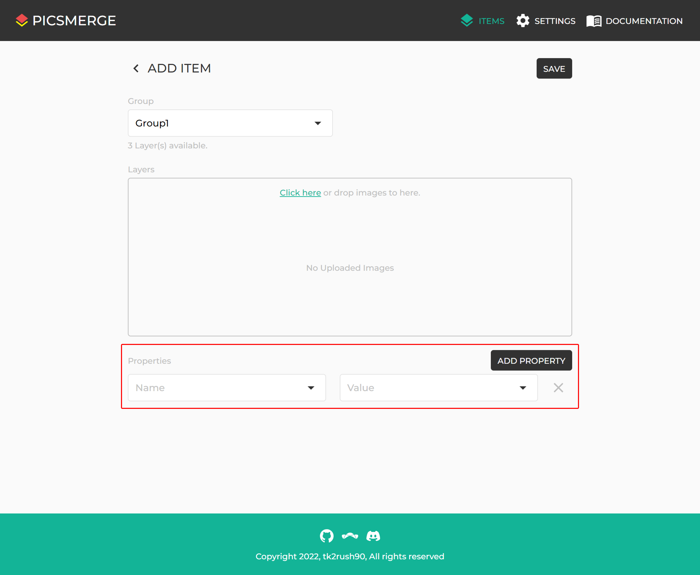

# Property

To register NFT in [Opensea](https://opensea.io/), you can set some Properties to Items.

You can set predefined Properties when creating an Item.

Move to [How to Create Property](/app/documentation/property/create) to learn creating a Property.
